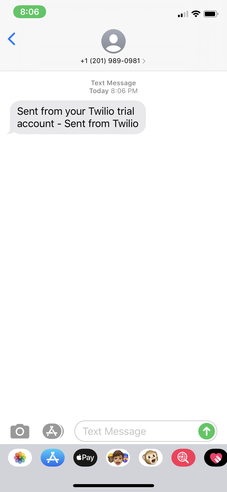

# Twilio-SMS
## Using Twilio's API to send and receive text messages


## Project Purpose:
`The purpose of this project was to integrate the Twilio API using REST endpoints to send and receive text messages.`

## Setup
<p> First, I created a Twilio trial account and set up a phone number. </p>

<p> Second, I used Spring Initializr to generate a Spring Boot project structure. I created a Maven project named "Twilio-SMS" and imported the project to the Eclipse IDE. </p>
<p> Lastly, once the project was imported, I made sure the following dependencies were included: Spring Boot Web, Spring Boot Test, Project Lombok, and Twilio's own dependency. </p>

## Process & Implementation
Created the following: 
  - Configuration class -> tells Spring Boot this is a bean for dependency injection
  - Initializer class -> intializes the connection with the Twilio API
  - TextMessageSender interface -> used for sending text messages
  - Request class -> provides phone number and message to send
  - TwilioTextSender class -> send a text with the Twilio API
  
 ## Final Output
 
 <p> As we can see, I received a text sent with the custom message "Sent from Twilio." </p>
   
 ## Additional
 I incorporated [Project Lombok], a Java library that is used to reduce "boilerplate code", into this project. This allows for an easy way to declare getters and setters without having to type them. Just by using @Getter before variable declaration, a getter is created during compilation, making our file more readable and concise.
 
 
For example, in the [Twilio Configuration] file, by using the @Getter and @Setter annotations, getters and setters are generated for the 3 variables declared.

``` java
@Getter @Setter private String ACCOUNT_SID = System.getenv("TWILIO_SID"); 
@Getter @Setter private String AUTH_TOKEN = System.getenv("TWILIO_AUTH"); 
@Getter @Setter private String trialNumber; 
```
[Project Lombok]: https://projectlombok.org/features/all
[Twilio Configuration]: https://github.com/nikhmath123/Twilio-SMS/blob/master/src/main/java/com/twilio/TwilioConfiguration.java
